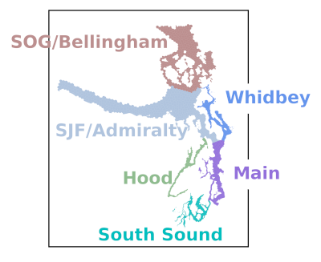

# Salish Sea Model analysis at Puget Sound Institute  (PSI)

This repository contains a collection of post-processing files designed to
create tables, graphics, and movies from Salish Sea Model output. This work
was funded by King County.

The most current version of the PSI code supports computing the Metabolic
index for three species across Puget Sound and the Straits for the assoicated report,
as well as incorporating the the majority of code used to produce disolved oxyen metrics
and data for prior repots published by PSI. This included the regional sensitivty anaysis series of 
reports for regions of Northern Bays (including Bellingham), Whidbey, and Main Basin 
(Lead contributor of code Racheal Mueller) See [the original code](releases/tag/v1.1) which contains detailed
explanations of the original code used in those reports.  Updates and further metrics on dissolved oxygen where 
done by Ben Roberts and Stefano Mazzilli and applied in PSI repeorts and it is recommended to use this most recent version of the code (described further below) which is maintained going forward.
See the [project website] (https://www.pugetsoundinstitute.org/nutrients/) on the PSI web pages for all reports using this code.

## General Organization

The directory [py\_scripts](py_scripts/) contains all of the low-level
processing code in the form of Python scripts that can be executed on the
command line. The required Python environment is defined in
[environment.yml](environment.yml). Most intensive computation is handled
by the package [ssm\_utils](py_scripts/ssm_utils/). [Unit tests](tests/)
mostly apply to this package. Some extra one-off investigative or debugging
code is in the form of [Jupyter notebooks](notebooks/) although much of
this is not used reguarly in workflow or requires changes to adapt to your 
specific outputs and environment.

Python scripts generally read a YAML-formatted case file to know where
various dependencies can be found and the values of certain critical
parameters. The scripts are usually best executed via shell scripts to
assemble a full post-processing workflow; full examples of such workflows
can be found in [examples](examples/), including [for our latest metabolic
index study](examples/metabolic_index/).

The code requires two additional components which are not published here:
some [shapefiles](https://ww.github.com/UW-PSI/SalishSeaModel-grid)
(private repository) that define the Salish Sea Model and 303(d) grid
geometries, and the `process_netcdf.py` script for making the first
intermediate extractions from various formats of SSM NetCDF output files.
Please contact Stefano (mazzilli@uw.edu) if you intend to use this code, or wish to collaborate in anyway and receive processed outputs, or any additonal components you may need. In particular we are seeking collaboration with folks working on habitat assessments for species of  the Salish Sea that may be able to use or advance the aerobic habitat products in this repository and associated datasets.

## License and Copyright

All contents in this repository copyright (c) 2022-2026 by University of
Washington and created by Rachael D. Mueller/Ben Roberts (unless otherwise
specified) in collaboration with the [Project
Contributors](docs/CONTRIBUTORS.rst) at the [University of Washington's
Puget Sound Institute](https://www.pugetsoundinstitute.org). This work was
funded by King County.
