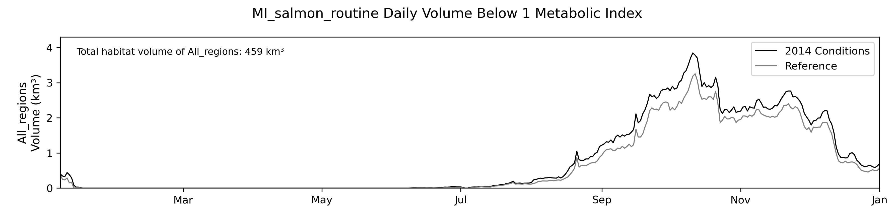
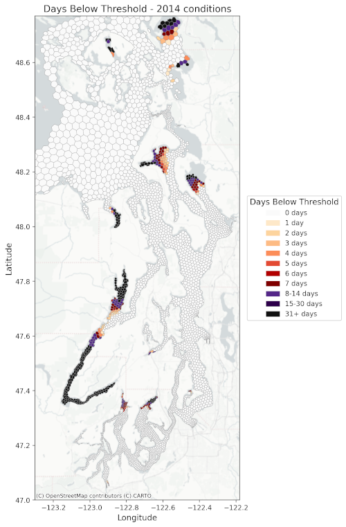
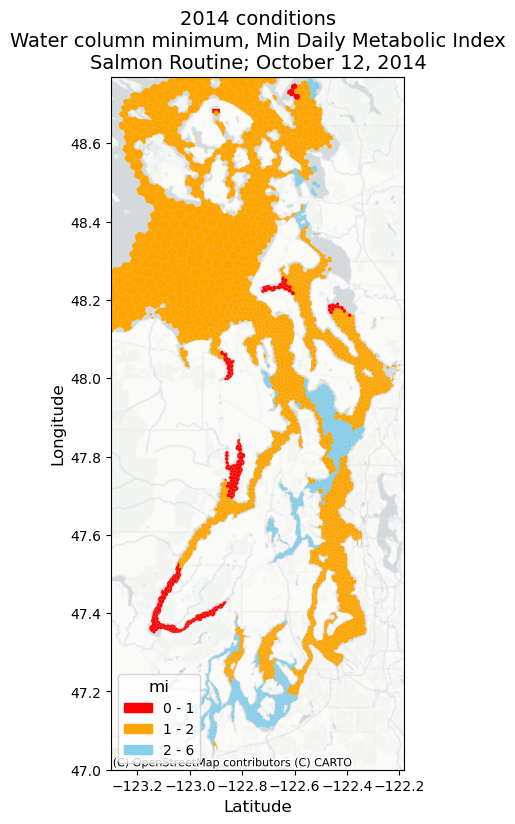

# Table of contents
1. [Introduction](#intro)
2. [Setup](#setup)
    1. [System requirements](#requirements)
    2. [Creating run configuration](#configuration)
    3. Populate scripts
    4. Unit tests
3. [Common Script Tasks](#tasks)
    1. Model Skill
    2. Nutrient Loadings
    3. [Extraction](#extraction)
4. [Dissolved Oxygen Workflows](#doxg)
    1. DO Below Threshold
    2. Noncompliance
    3. Multi-threshold Stacked Volumes
5. [Metabolic Index Workflows](#mi)
    1. DO Saturation
    2. Metabolic Index
    3. Metabolic Index Below Threshold
6. [Exposure and Return Time](#exposure)
    1. Exposure, Return, and Net Exposure Calculation
    2. Exposure, Return, and Net Statistics
7. [Graphics](#graphics)
    1. Daily Volume/Area Timeseries
    2. Planar Duration Plots
    3. Daily Animated Planar Plots
8. [QAQC: Making sure there aren't problems with the inputs and outputs](#QAQC)
    1. [Nutrient loading inputs](#qaqc_loading)  
    2. [Model output](#qaqc_modeloutput)
9. [Reference links](#references)

# Introduction 
The goal of this file is to provide an overview of the setup and resources
required to develop the tables, graphics, and animations provided to King
County for the evaluation of nutrient loading impacts. The data to create
these graphics and tables are not included and would need to be provided by
Stefano Mazzilli at Puget Sound Institute. Please email [Stefano
Mazzilli](mailto:smazzilli@uw.edu) with comments, suggestions, and/or
corrections to the code or documentation, or submit an issue here on
Github.

# Setup 
## Requirements 
1. A Linux or possibly Mac OS X environment is needed. Windows Subsystem for
Linux (WSL) should work fine also.
2. A conda environment in which to run scripts and notebooks
([miniforge](https://github.com/conda-forge/miniforge) is recommended but
miniconda works too). The environment file is provided here; set it up with
the command `conda env create -f environment.yml`
3. FFMPEG, or on Hyak, an Apptainer "Container" in which to run FFMPEG. See FFMPEG section of
[HyakOnboarding.md](HyakOnboarding.md#ffmpeg). 
4. Create a file `apis.py` based on the `apis-example.py` file provided. If
you do not have a Stadia Maps key, leave that line out.

## Create run configuration 
1. Define run and model output file locations.
2. Create the case file. YAML files can be edited directly, but it's
generally easier to use a Jupyter notebook like
[SSM\_config\_ecy21.ipynb](../examples/ecology_2021/SSM_config_ecy21.ipynb) which
includes some error checking and documentation.
3. Put the case file in the top-level directory where you want your
   processing results to be. It's possible to run everything directly out
   of the examples subdirectories, but it's probably better to set up your
   own location where you can make customizations for a particular
   workflow.
4. Most of the latest shell scripts look for a file `paths.rc` which
   defines how to invoke your conda environment and where the case file is.
   Most of your custom changes will need to be made there to get the
   scripts to run.

## Populate scripts

The examples contain various shell scripts which can in turn invoke the
python scripts to create a full post-processing workflow. They contain
SLURM headers so they can be invoked on a cluster computing environment
with sbatch, but they do not depend on any SLURM-specific functionality so
they can also be executed directly on any generic Unix-like environment.

## Unit Tests

It's a good idea to make sure the low-level code is working correctly, so
there's often a simple script that can invoke all the included unit tests
via Python's builtin test discovery. A successful run should be
self-explanatory, and very little output will be generated.

Errors could potentially be caused by compatibility issues introduced in
upstream packages.

# Common Script Tasks 

Note that all recently updated scripts perform standard argument/options
processing and can provide hints for how to invoke them by running them
with the option `-h` or `--help`, just like most UNIX commands.

## Model Skill (plot\_model\_skill)

The Python script
[plot\_model\_skill.py](../py_scripts/plot_model_skill.py) reads a
[paired observed and model-simulated water quality
spreadsheet](https://fortress.wa.gov/ecy/ezshare/EAP/SalishSea/SalishSeaModelBoundingScenarios.html)
and replaces the model values with ones extracted from your own copies of
model output files.

## Nutrient Loadings (calc\_nutrient\_loadings)

The script `calc_nutrient_loadings.py` reads a SSM freshwater input file
and summarizes all of the riverine and point source loads by region. By
default it looks at all constituents of dissolved inorganic nitrogen (DIN),
but it can accept arguments to add or alter what type of loading it
considers.

## Extraction (process\_netcdf) 

The script `process_netcdf.py` reads hourly model output files of three
different recognized formats (FVCOM-ICMv4 native output, Ecology's
converted format, and ssmhist2cdf single-file output) and extracts a state
variable using a given daily reduction operation (mean, max, min). These
NetCDF datasets are much smaller that the model output files themselves and
are more convenient to transfer between systems, for instance if you have
your model outputs on a different computing environment than where you want
to perform the rest of your analysis.

Outputs are kept by default in `SSM_data/<case>/<variable name>/<scenario
name>`. This script is able to also create surface-layer-only and
bottom-layer-only extractions, although we don't use those much in our
workflows anymore.

State variable names are the same as what the FVCOM-ICM model itself uses:

 * temp (temperature)
 * salinity
 * DOXG (dissolved oxygen)
 * NO3 (total nitrate + nitrite)
 * NH4 (ammonia)
 * ...and so on.

# Dissolved Oxygen Workflows 

## DO Below Threshold (calc\_below\_threshold)

The script `calc_below_threshold.py` uses the master shapefile to compute
duration, volume and area statistics of affected regions that fall below a
threshold for any state variable; once an extraction is run for the model
state variable `DOXG`, this script can run directly to assess DO below a
threshold value like 2 or 5 mg/L.

This script also produces geojson shapefiles of per-TCE duration below a
threshold.

## Noncompliance (calc\_noncompliance, calc\_noncompliance\_timeseries, calc\_noncompliant\_area\_timeseries)

The noncompliance scripts perform customizable computations of volume and
area DO noncompliance using Ecology's methodology as described in [Ahmed
2021](https://www.ezview.wa.gov/Portals/_1962/Documents/PSNSRP/TechMemoPSNSRPOptimizationScenariosPhase1.pdf)
Appendix F. It is also able to work on DO extracted using a 303(d)
regridding with the script `process_netcdf_303d.py` to replicate Ecology's
latest methods from [Figueroa-Kaminsky
2025](https://apps.ecology.wa.gov/publications/summarypages/2503003.html)

They all require an intermediate extraction of daily minimum DOXG.

These scripts take several important arguments. One is a configurable
threshold parameter: officially a -0.2 mg/L difference is used to assess
compliance, but since 2021 Ecology has been rouding the final magnitudes of
noncompliance which results in an effective compliance threshold of -0.25
mg/L. The correct parameter should be selected based on which methodology
is in use. Noncompliance is performed using two separate checks which
Ecology terms "Part A" and "Part B;" the scripts allow for skipping the
Part A check, which is mainly useful for PSI internally to reproduce
earlier results.

## Multi-threshold Stacked Volumes (plot\_multi\_threshold\_stacked\_volumes)

This script directly invokes the computational functions of
`calc_below_threshold.py` to build per-region timeseries plots that stack
the daily volumes below various DO thresholds rather than a single one.

# Metabolic Index Workflows 

## DO Saturation (DO\_Saturation)

The script `DO_Saturation.py` reads daily min/max/mean DOXG and mean
temp+salinity, then uses them to compute daily mean conservative
temperature (CT) and min/max/mean oxygen partial pressure (pO2) via the
solubility. These are output to `SSM_data/<case>/CT` and
`SSM_data/<case>/pO2` as if they were intermediate extracts from the
model itself.

These are needed for the metabolic index calculation.

## Metabolic Index (calc\_mi)

The script `calc_mi.py` accepts arguments for a species name, and whether
to use routine or basal (`smr`) metabolism, to compute the metabolic index
at every time and location. Outputs are in `SSM_data/<case>/mi`, and each
NetCDF file is named for the species and method used. NetCDF files also
include variables for the upper and lower bounds of the confidence interval.
It always computes both the daily maximum, mean, and minimum MI using the
max, mean and min pO2, plus the mean CT.

## Metabolic Index Below Threshold (calc\_below\_threshold)

The same `calc_below_threshold.py` script that handles DO below threshold
computations is also able to perform the same processing on metabolic index
intermediate NetCDF files.

# Exposure and Return Time 

## Exposure, Return, and Net Exposure Calculation (exposure\_return\_time)

The script `exposure_return.py` works on a state variable or metabolic
index to identify individual exposure events and measure their total and
net durations. Net duration takes into account days where the daily maximum
exceeds the given threshold even if the daily minimum is below; as such,
this script works best when both max and min intermediate NetCDF extracts
were made. The output is an intermediate NetCDF file in
`SSM_data/<case>/ExposureReturn`.

## Exposure, Return, and Net Statistics (exposure\_return\_time\_stats)

The script `exposure_return_stats.py` reads the intermediate NetCDF file
made above to compute various regional aggregate statistics and per-node
exposures/net exposures. Aggregates are output to spreadsheets, and
per-node data is output to geojson shapefiles. It can restrict its
operation to specific depth layers or operate on the entire water column,
which is why it's separate from the first script which always computes the
entire water column.

# Graphics 

Most of the graphics scripts are agnostic to which state variable workflow
they are part of, and simply need the required shapefile or spreadsheet to
exist already.

## Daily Volume/Area Timeseries (plot\_daily\_volumes\_simple)

The script `plot_daily_volumes_simple.py` reads a spreadsheet output from
`calc_below_threshold.py` and generates per-region timeseries plots of the
daily volumes (or areas when invoked with the option `-a`).

## Planar Duration Plots (plot\_planar\_days\_below\_threshold)

The script `plot_planar_days_below_threshold.py` reads a shapefile
generated by either `calc_below_threshold.py` or
`exposure_return_time_stats.py` and plots a requested column. It can plot
total (gross) durations or various sums from the exposure and return
statistics.

## Daily Animated Planar Plots (plot\_conc\_graphics\_for\_movies)

The script `plot_conc_graphics_for_movies.py` reads an intermediate NetCDF
output file for the given state variable or metabolic index, and generates
daily planar plots. If called with the `-m` option, it invokes FFMPEG at
the end to generate a movie of the sequence. It has a somewhat complex
internal data structure that defines what color scheme and binning to use
based on the variable being plotted, and whether it's a delta plot
(reference condition subtracted out).

# QAQC: Making sure there aren't problems with the inputs and outputs 
## Nutrient loading inputs   
Salish Sea Model nitrogen inputs are in units of concentration but some of our runs required altering loading.  In these runs, I needed to scale concentrations appropriately in order to accurately change the loading.  These graphics reflect my internal QAQC to ensure that I scaled the nitrogen levels correctly and as requested.  
1. Validating the nutrient input loadings for Main region: [validate_SSM_input_loading_main.ipynb](https://github.com/RachaelDMueller/SalishSeaModel-analysis/blob/main/notebooks/QAQC/validate_SSM_input_loading_main.ipynb)
2. Validating the nutrient input loadings for Whidbey region: [validate_SSM_input_loading.ipynb](https://github.com/RachaelDMueller/SalishSeaModel-analysis/blob/main/notebooks/QAQC/validate_SSM_input_loading.ipynb)

## Model output 
1. Histograms of DO difference between 2014 and scenario [QAQC_DeltaDO_DeltaNO3_MainRegion.ipynb](http://localhost:8800/lab/workspaces/auto-1/tree/PSI-analysis/notebooks/QAQC/QAQC_DeltaDO_DeltaNO3_MainRegion.ipynb).
2. Comparing normalized nitrogen loading to normalized noncompliance.  Other models that I've worked with have crashed when solutions become infinite but that's not the case with this version of ICM.  The way that I learned this was to notice outliers in plots that compare normalized noncompliance to normalized nitrogen.  See cases `Wtp1` (typo for `Mtp1`) and `Mtp2` in below figure. 

A closer look revealed oxygen outputs that I recall being O(1e38), i.e. too high.  There were reported issues with MPI on the HPC at the time.  Su Kyong and I are suspicious that these high numbers are the result of a glitch in the parallel processing. Re-running the erroneous runs fixed the problem.  

The concept for the graphic of normalized non-compliance to normalized nitrogen loading was introduced by Joel Baker and developed further here to separate out the cases where nitrogen loading is varied in WWTPs from those in which nitrogen is varied in river inputs.  

# References 
The following files are not public and require access permission through the Puget Sound Institute. 
1. [Municipal model runs and scripting task list.xlsx](https://uwnetid.sharepoint.com/:x:/r/sites/og_uwt_psi/Shared%20Documents/Nutrient%20Science/9.%20Modeling/Municipal%20%20model%20runs%20and%20scripting%20task%20list.xlsx?d=w417abadac06143409d092a23a26727e6&csf=1&web=1&e=tgJY69) (Internal PSI document)
2. [Whidbey configuration file](https://github.com/RachaelDMueller/SalishSeaModel-analysis/blob/main/etc/SSM_config_whidbey.ipynb)
3. [Whidbey_Figures&Tables.xlsx](https://uwnetid.sharepoint.com/:x:/r/sites/og_uwt_psi/_layouts/15/Doc.aspx?sourcedoc=%7B9011F04E-F423-4B45-A0EA-75338168A1B3%7D&file=Whidbey_Figures%26Tables.xlsx&action=default&mobileredirect=true) (Internal PSI document)
4. [SOG_NB_Figures&Tables.xlsx](https://uwnetid.sharepoint.com/:x:/r/sites/og_uwt_psi/_layouts/15/Doc.aspx?sourcedoc=%7B3788B09C-126F-40BF-86AF-22DEC185E831%7D&file=SOG_NB_Figures%26Tables.xlsx&action=default&mobileredirect=true) (Internal PSI document)
5. [Main_Figures&Tables](https://uwnetid.sharepoint.com/:x:/r/sites/og_uwt_psi/Shared%20Documents/Nutrient%20Science/9.%20Modeling/7.3%20Main/Main_Figures%26Tables.xlsx?d=wa78a9065fcb640b488399c16db32def4&csf=1&web=1&e=V4z8Bd) (Internal PSI document)

